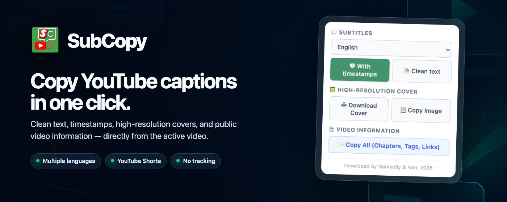
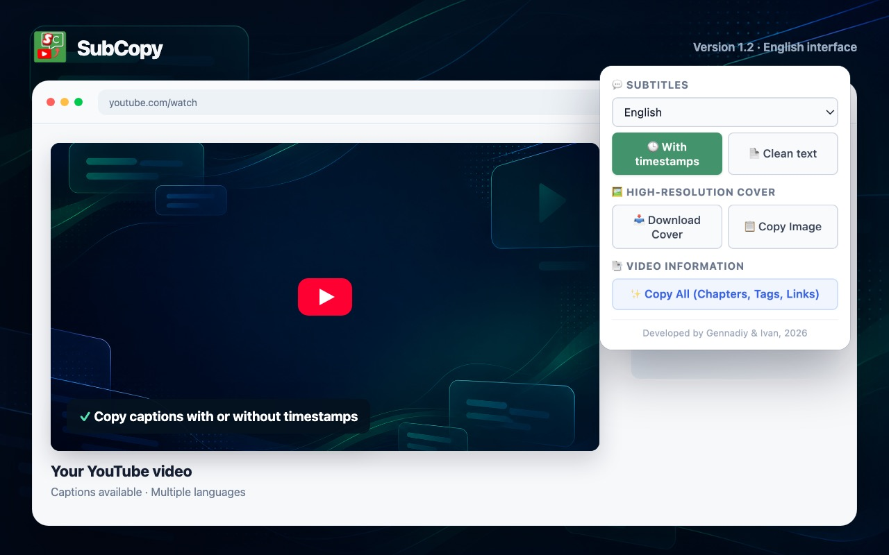

  

  # SubCopy

  Copy YouTube captions, thumbnails, and public video details in one click.

  
  
  

## Features

- Captions with timestamps or as clean text
- Language selection for available subtitle tracks
- Highest-resolution thumbnail download or clipboard copy
- Video details exported as Markdown: chapters, tags, links, and metadata
- YouTube Shorts support and interface localization in 8 languages

  

## Use

Open a YouTube video, click the SubCopy icon, then choose the content and format you need.

For local testing, enable Developer mode at `chrome://extensions`, choose **Load unpacked**, and select this directory. SubCopy is a Manifest V3 extension with no build step.

## Privacy

SubCopy has no analytics or tracking and does not send user data to developer-controlled servers. See the [privacy policy](docs/privacy-policy.md).

## Authors

Gennadiy Zakharov · [Ivan Kononov](https://github.com/konon4)
